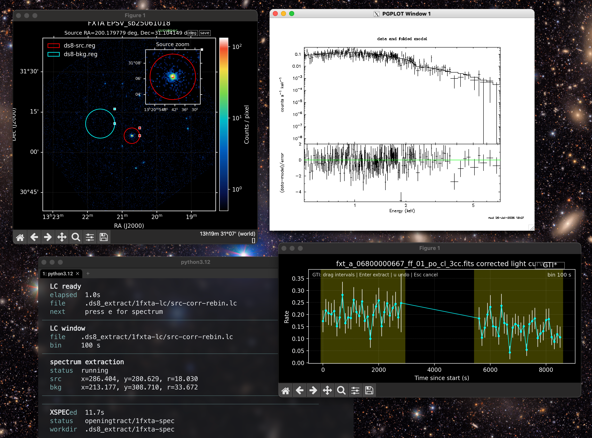

# ImageDS8

English | [中文](CN_README.md)

Interactive EP/FXT region picker: 
drag regions → extract curve → extract spectra → call XSPEC.



```
bin/  ds8  ds8_frame_plot.py  ds8_io_names.py  xspec_init  ds8-{fxt,wxt}.toml
set_headas.sh   README.md   CN_README.md
```

## Prerequisites

- **Python ≥ 3.11** with **numpy**, **matplotlib**, **astropy**:

  ```bash
  # pip — into the active venv / interpreter
  pip install "numpy>=1.24,<3" "matplotlib>=3.7" "astropy>=5.3"
  # conda — new env named ds8
  conda create -n ds8 python=3.12 "numpy>=1.24,<3" matplotlib astropy
  conda activate ds8
  # pixi — global env, exposes python3 on PATH
  pixi global install --environment ds8 --expose python3 python=3.12 numpy matplotlib astropy
  ```
- **fxtdas** (bundled EP/FXT data reduction package by IHEP: https://epfxt.ihep.ac.cn/analysis )
- **CALDB** (require register of EP instruments. see fxtdas manual)
- **Environment Modules** (optional) when using `module` mode to manage the
  HEASOFT/fxtsoft version and `PATH`

## Install & environment

Keep the 6 files in `bin/` together (the main script locates the other scripts and the config templates relative to itself). 

Most users run ImageDS8 with a standard, already initialized **HEADAS** environment.
Set `mode = "headas"` in the observation's generated TOML, then initialize
HEASOFT/fxtsoft and CALDB in the shell that launches `ds8`. The bundled
`set_headas.sh` can be edited for the local installation and sourced, for example:

```bash
export PATH="/path/to/ImageDS8/bin:$PATH"
# set_headas.sh — edit these two paths to match your install (it then sources the init scripts):
#   export HEADAS=/path/to/fxtsoftv1.30/fxt/<arch>   # sources $HEADAS/headas-init.sh
#   export CALDB=/path/to/CALDB                      # sources $CALDB/software/tools/caldbinit.sh
source /path/to/set_headas.sh        # fxtsoft (HEASOFT) + CALDB
```

ImageDS8 also supports **Environment Modules** as an optional PATH and version
manager. Users with a suitable module can select `mode = "module"` and configure
`module` plus `modules_init` in the TOML. CALDB must still be initialized in the
launching shell.

## Quickstart

Assumes `ds8` is on `PATH` and the Python dependencies are installed (see
[Prerequisites](#prerequisites) and [Install & environment](#install--environment)).
The examples below use the standard HEADAS workflow: set the generated TOML to

```toml
[heasoft]
mode = "headas"
```

and initialize HEASOFT/fxtsoft and CALDB before launching `ds8`. If your system
uses Environment Modules to manage these tools, keep `mode = "module"`, configure
`module` and `modules_init`, and initialize CALDB separately.

### WXT

1. **Enter the WXT observation directory.** It should contain the cleaned event
   file and the existing RMF/ARF for the selected source. The default patterns are
   `ep*wxt*po_cl.evt`, `ep*wxt*.rmf`, and `ep*wxt*s1.arf`:

   ```bash
   cd /path/to/wxt-obsdir
   ```

2. **Scaffold the WXT config** — this writes `ds8-wxt.toml` and exits. Check
   `[instrument].source` and the patterns under `[inputs]` if the source number or
   product names differ:

   ```bash
   ds8 --inst wxt .
   ```

3. **Launch and extract:**

   ```bash
   ds8 .
   ```

   In the image window, drag the source and background regions into place, press
   **`e`** to extract the light curve, press **`e`** again to extract the spectrum
   using the existing WXT responses, and press **`x`** to open XSPEC.

### FXT

1. **Enter the FXT observation directory.** It must contain an FXT-A and/or FXT-B
   cleaned event file and the matching MKF file, for example
   `fxt_a_*_po_cl_*.fits`, `fxt_b_*_po_cl_*.fits`, and `fxt_*_mkf_*.fits`:

   ```bash
   cd /path/to/fxt-obsdir
   ```

2. **Scaffold the FXT config** — this writes `ds8-fxt.toml` and exits. Edit the
   generated file if the defaults do not fit:

   ```bash
   ds8 --inst fxt .
   ```

3. **Launch and extract:**

   ```bash
   ds8 .
   ```

   When both the FXT-A and FXT-B cleaned event files are present, `ds8` opens them
   **side by side in one window**. A single source/background region is shared across
   both detectors by sky (FK5) position — drag it on either panel and it moves on both.
   Light curves, spectra and XSPEC then run for **both detectors in parallel** (XSPEC
   loads them as `data 1:1` FXT-A and `data 2:2` FXT-B with each detector's response
   files). Pass `--detector a` or `--detector b` to force the classic single-detector view.

   In the image window, drag the source and background circles into place, press **`e`** to extract the light curve (both detectors, shown as two subplots), then press **`e`** again to extract the spectra (both detectors), and **`x`** to open XSPEC with both loaded.

## Usage

```bash
ds8 <obsdir> --inst fxt         # Scaffold only: write ds8-fxt.toml into <obsdir> and exit (does not launch).
ds8 <obsdir> --inst wxt         # Scaffold only: write ds8-wxt.toml into <obsdir> and exit.
ds8 <obsdir>                    # Launch: WXT single view, or parallel FXT A/B when both files exist.
ds8 <obsdir> --detector b       # FXT: force the classic single-detector view.
```

`--inst` never launches and never overwrites an existing `ds8-<inst>.toml`. Edit the generated copy, then run `ds8 <obsdir>` to launch. The bundled templates in `bin/` are only ever copied out this way; they never drive a running session.

Image window:

| Key | Action |
|---|---|
| drag knobs | move and resize source & background circles |
| `e` | extracts the light curve / spectrum |
| `x` | open XSPEC with an current spectrum |
| `c` / `b` | centroid source / auto-pick background |
| `Tab` | toggle region type: circle ↔ annulus |
| `r` / `R` | toggle all reference overlays / reset |
| `s` / `q` | save PNG / quit |

When region files are absent, ds8 places the generated source circle at image
centre and offsets the generated background circle so the two do not overlap.

Light-curve window:

| Key | Action |
|---|---|
| `=` / `-` | change bin (`Ctrl` ×10, `Cmd` ×100) |
| `g` | enter GTI mode |
| click - drag | select time intervals |
| `Enter` | extract selected intervals |
| `x` / **XSPEC** | open XSPEC with the first extracted GTI (`gti01`) |
| `u` / `Esc` | undo last interval / cancel |

Each GTI spectrum extraction also writes source PHA files pre-grouped to minimum
counts of 3 and 20 (`*-g3.pha` and `*-g20.pha`), matching the whole-observation
spectrum extraction.

## Configuration

One `ds8-<inst>.toml` per obs dir. Create it with `ds8 --inst <inst> <dir>` (writes the template and exits), edit the copy, then run `ds8 <dir>`. Common CLI (`-h` for all):

| Option | Default | Meaning |
|---|---|---|
| `--inst {fxt,wxt}` | — | scaffold only: write `ds8-<inst>.toml` into PATH's dir and exit; never launches |
| `--detector {a,b}` | auto | force the single-detector view; unset opens the parallel A/B view when both event files are present |
| `--lc-bin` | `100` | light-curve bin (s) |
| `--pha-min` / `--pha-max` | `38` / `925` | light-curve PHA channels (spectra are not limited by this) |
| `--mkf` / `--extract-dir` | auto / `.ds8_extract` | exposure-map MKF / scratch dir |

### Reference region

An optional reference region is drawn as a read-only purple dashed overlay and is
never used for light-curve or spectrum extraction. Press `r` in the image window
to hide or restore all reference overlays. Configure an inline FK5 circle:

```toml
[reference_region]
ra = 83.633083
dec = 22.014500
radius = "30arcsec"
label = "catalog position"       # optional
color = "#DA70D6"                # optional; this is the default
```

`ra` and `dec` accept decimal degrees; RA also accepts sexagesimal text. A numeric
`radius` is interpreted as degrees, while strings may use `deg`, `arcmin`, or
`arcsec`. Alternatively, load every circle/annulus from a DS9 FK5 file whose path
is relative to the observation directory:

```toml
[reference_region]
file = "reference.reg"
label = "reference"              # optional
color = "#DA70D6"                # optional
```

Use either the inline coordinates or `file`, not both.

### EPSC pipeline sources (FXT)

FXTA and FXTB can each load their own EPSC pipeline source catalog. Declare both
CSV paths when using the parallel A/B view:

```toml
[epsc_sources]
a = "/path/to/srca.csv"          # drawn only on the FXTA panel
b = "/path/to/srcb.csv"          # drawn only on the FXTB panel
color = "#7CFC00"                # optional; green by default
snr_threshold = 7.0               # optional; values below this are gray
```

Relative paths are resolved from the observation directory. The CSV must contain
`RA`, `Dec`, and `SNR` columns, with the coordinates in decimal degrees. Sources are
shown as fixed-size circles and labelled `1, 2, 3, ...` in CSV data-row order.
Sources below `snr_threshold` are automatically drawn gray; the rest use `color`.
These markers are display-only and do not affect extraction. In a forced
single-detector view, only that detector's CSV entry is required.

### HEASOFT environment

The usual workflow uses an already initialized HEADAS environment:

```toml
[heasoft]
mode = "headas"
```

In this mode, `ds8` uses `$HEADAS` and the HEASOFT/fxtsoft commands already on
`PATH`. Initialize CALDB in the same shell before launching.

Environment Modules is also supported as an optional PATH/version manager:

```toml
[heasoft]
mode = "module"
module = "heasoft/fxt1.30"
modules_init = "/opt/homebrew/opt/modules/init/profile.sh"
```

In module mode, CALDB must still be initialized in the launching shell. The
`DS8_HEASOFT_MODE`, `HEASOFT_MODULE`, and `MODULES_INIT` environment variables can
override the TOML settings.
